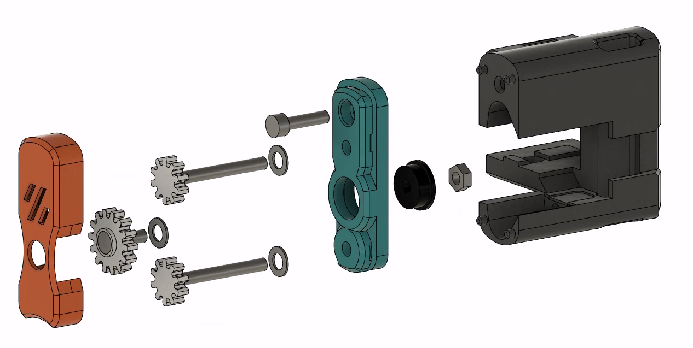
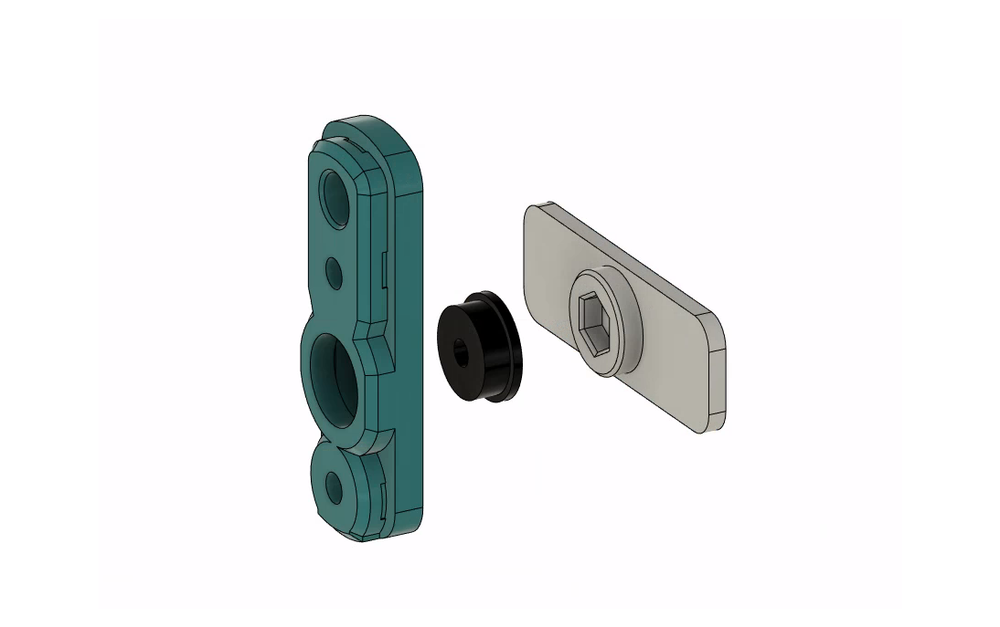
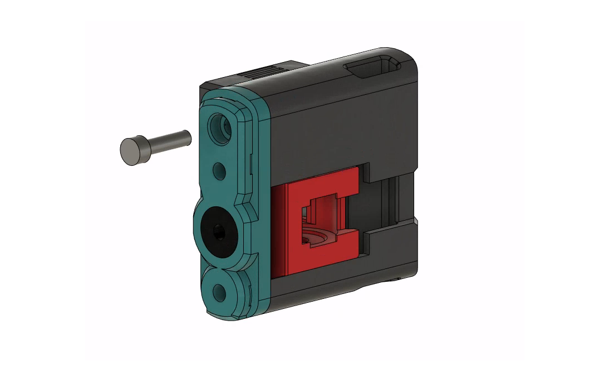
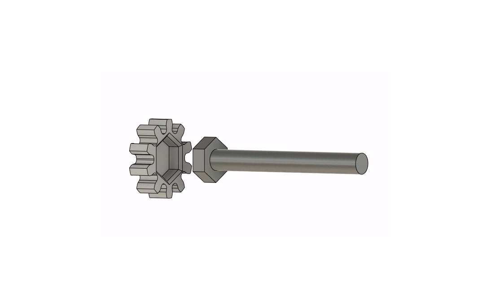
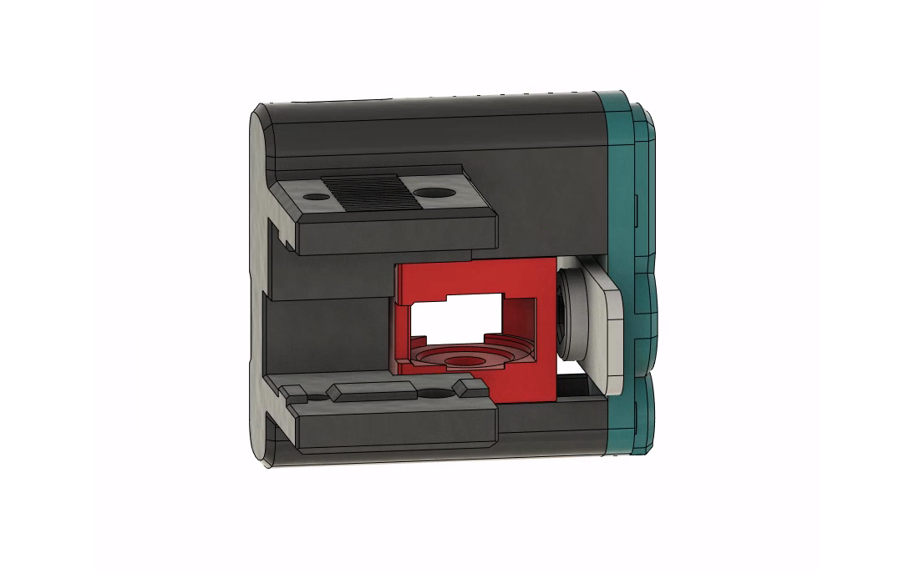
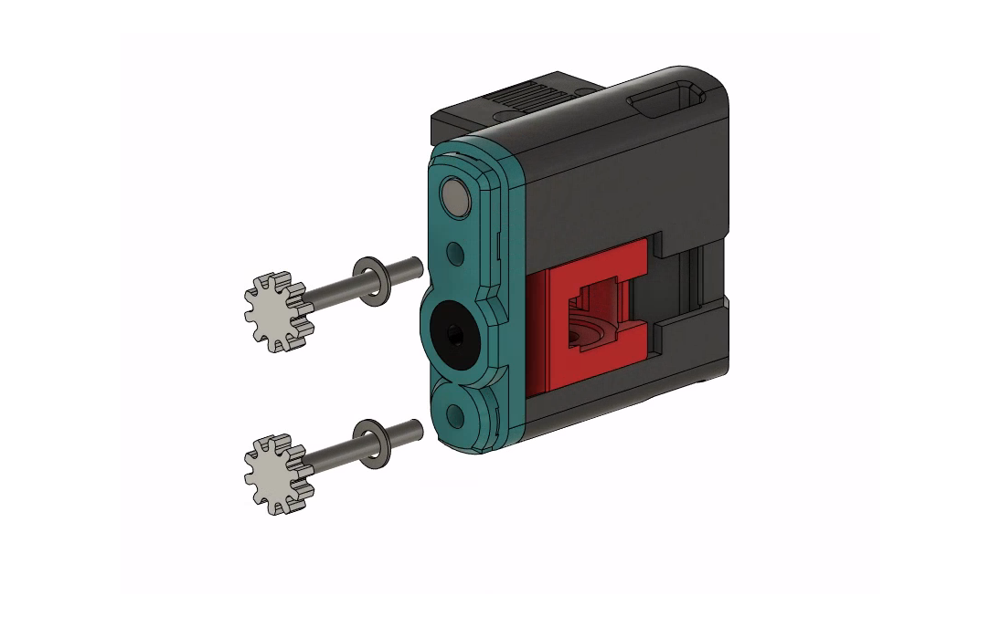
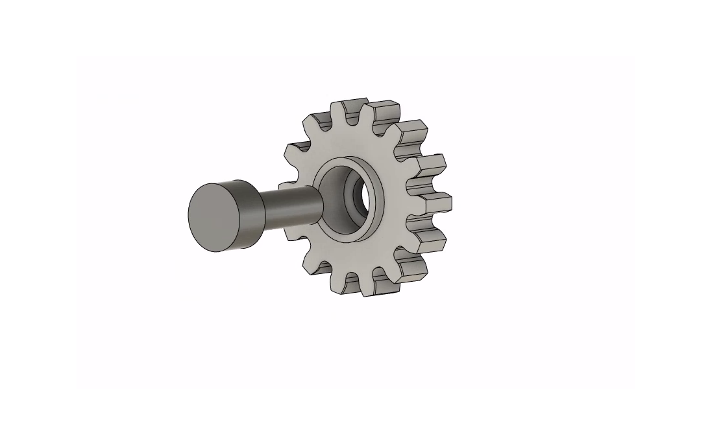
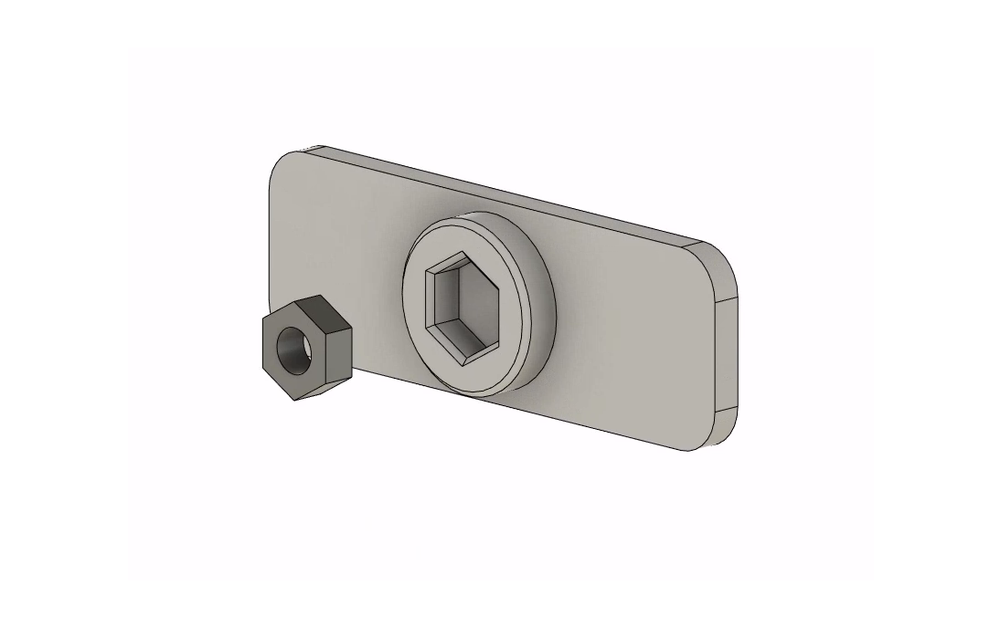
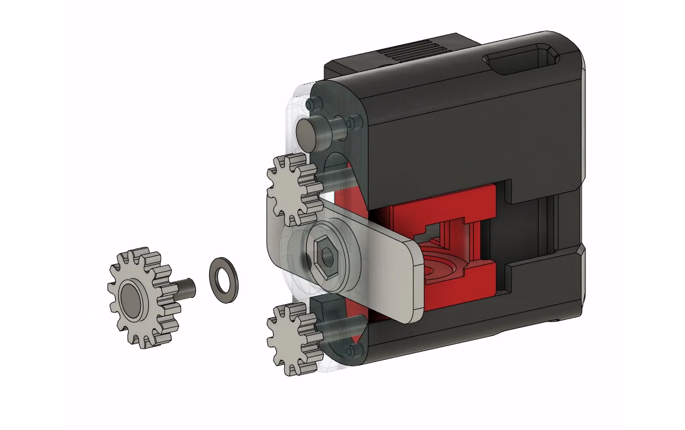
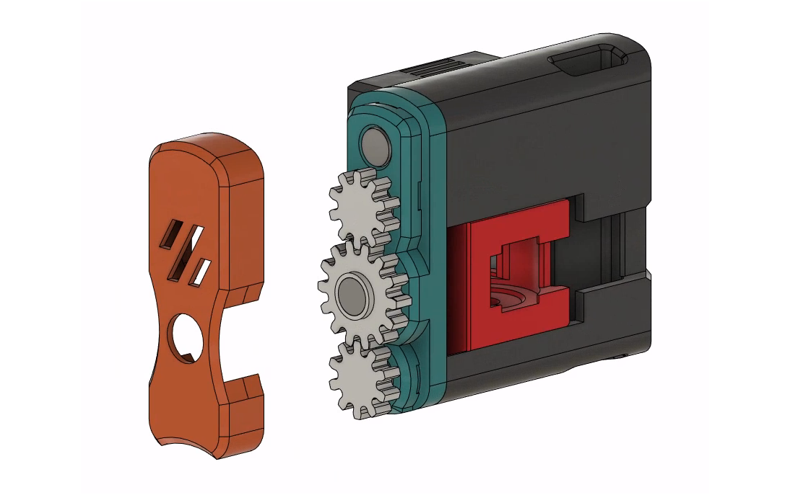

# Rama Idler Clockwork Cover
This is a mod of the [Rama front idlers](https://github.com/Ramalama2/Voron-2-Mods/tree/main/Front_Idlers) for the Voron 2.4. 

Its purpose is to keep the two tensioning screws synchronized by connecting them via a spur gear assembly in a housing cover.

The profile of the idler is identical to the original Rama idlers, however the mod takes an extra 4mm of space towards the doors of the printer for the gear assembly and cover.

https://github.com/zigzag-alchemist/RamaIdlerClockworkCover/assets/133815727/17510b1a-aaa8-4d9a-9919-942fed6e33c1

# Warning!

This mod has had relatively little testing and is very experimental.

It has been running fine in my machine (~100hrs of print time, 2 tensioning cycles) but there may still be dragons lurking.

# Printed Parts

- Print with the standard Voron settings:
  - No supports required.
  - Parts should already be orientated correctly for printing.
- The `suffixes_xN.stl`  denote the number of copies required for both left and right idlers. `[a]_` is for an optional accented color scheme.
- The `Housing_Cover_x2.stl` is the only printed part which replaces a part of the stock Rama Idler (the [Front-Idlers\_Housing-Cover.stl](https://github.com/Ramalama2/Voron-2-Mods/blob/main/Front_Idlers/Voron%202.4/STL/Front-Idlers_Housing-Cover.stl)).
- You probably only need one of the `HexNut_Tool` options. The `Short` version may be more useful if the idler is already mounted and you only have room on one side, but the regular version is easier to use.

# BOM (For 2 idlers, on top of the standard Rama Idler BOM)

Quantity      | Description              | Notes
|:----------- |:------------------------ |:---------------------------------------------
2             | M3x12 SHCS               |
2             | M8x12 SHCS               |
4             | M3x30/40 Hexhead DIN 931 | Replaces the M3x30/40 SHCS in Rama Idler BOM
2             | M3 Hexnut                |
6             | M3 Washer                |
2             | F623-2RS bearing         |

# Instructions

1. Use the `HexNut_Tool_x1.stl` to press the F623-2RS into both `Housing_Cover_x2.stl`

2. Complete the rest of the Rama Idler and then install the `Housing_Cover_x2.stl`
  with a M3x12SHCS. *Careful not to overtighten, it threads into plastic*

3. Pressfit the M3x30 Hexagon head bolt into the `10T_Spur_Gear_Hex_x4.stl`. *The `Press_Fit_Jig_x1.stl` may be helpful for doing this with a vice or clamp.*

4. Insert the 10T M3x30 spur gears into the Rama Idler housing
    1. For the convenience of Step 7, flip the `HexNut_Tool_x1.stl` and slot it into the house so the circular protrusion is facing the idler

    2. Gently tighten the M3x30 spur gears with M3 washers until they both slightly tug the idler flat and even against the `HexNut_Tool_x1.stl`

5. Use the `Press_Fit_Jig_x1.stl` to press the M3x8SHCS into the `14T_Control_Gear_x2.stl`

6. Slide out the `HexNut_Tool_x1.stl` if it is still in the Rama housing, and insert an M3 hexnut

7. Attach the `14T_Control_Gear_x2.stl` to the bearing
    1. Insert the `HexNut_Tool_x1.stl` with the captured hexnut is facing the F623 bearing
    2. Screw the M3x8SHCS and `14T_Control_Gear_x2.stl` with an M3 washer through the F623 bearing and into the HexNut 
    3. Use the `HexNut_Tool_x1.stl` to prevent the hexnut from turning, and firmly tighten the M3x8SHCS
    4. *As you tighten the M3x8SHCS, the two 10T spur gears will tend to screw outwards, just keep pushing them back in and keep them engaged with the 14T gear. This is why we left room for the idler to move inwards in Step 4*

8.  The `[a]_Outer_Cover_x2.stl` has small catches and can simply be pressed on until you hear a click
    1. *Side Note: The `[a]_Outer_Cover_x2.stl` is there to prevent the 10T gears from screwing outwards when the belts are completely loosened. During normal operation with tension on the belts the `[a]_Outer_Cover_x2.stl` it purely aesthetic and may indeed be left off entirely if desired*

9. To increase tension on the belts the exposed control screw must be turned anti-clockwise (and to decrease tension, clockwise). The gear mechanism reverses the tensioning direction from that of the standard Rama Idler
