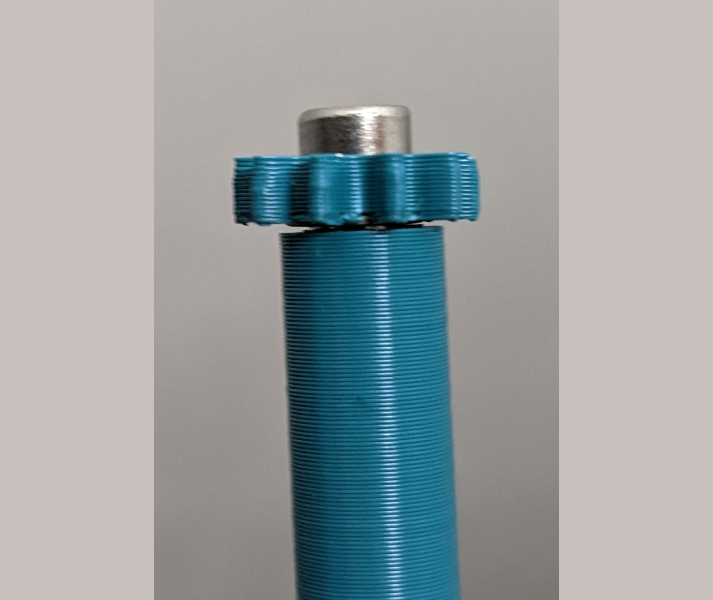
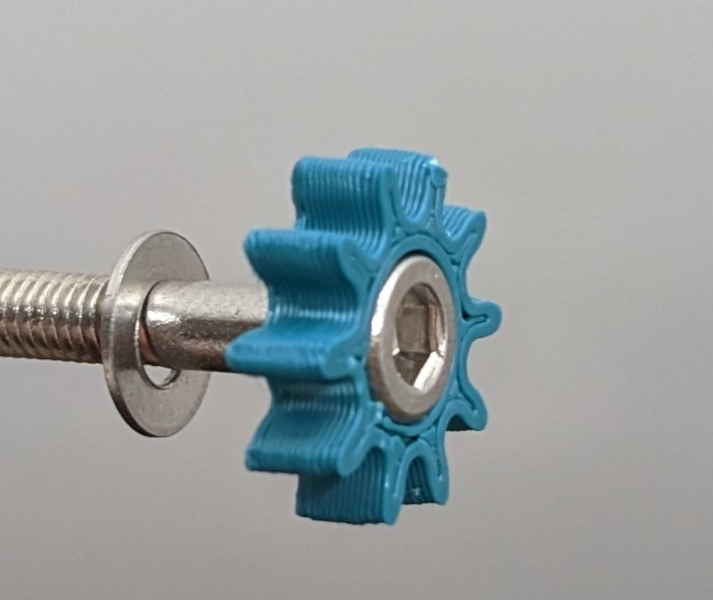
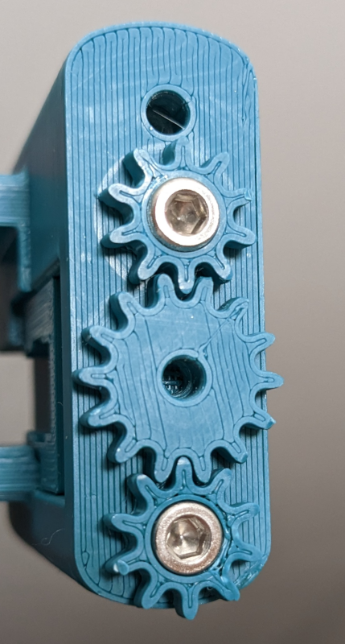
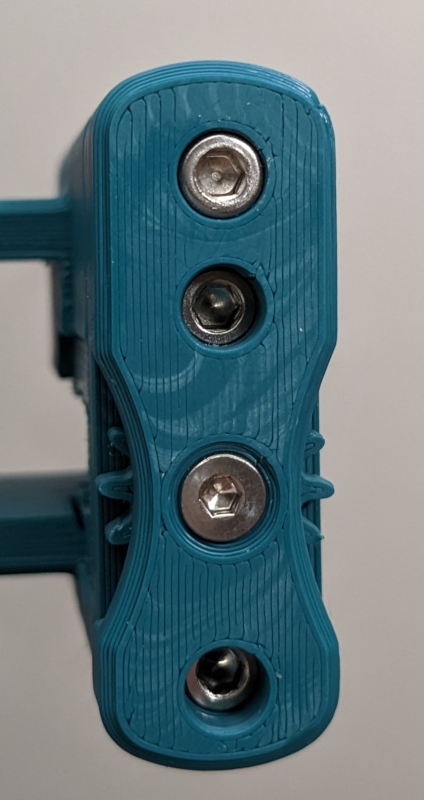

# Rama Idler Clockwork Cover
This is a mod of the [Rama front idlers](https://github.com/Ramalama2/Voron-2-Mods/tree/main/Front_Idlers) for the Voron 2.4. 

Its purpose is to keep the two tensioning screws synchronized by connecting them via a spur gear assembly in a housing cover.

The profile of the idler is identical to the original Rama idlers, however the mod takes an extra 4mm of space towards the doors of the printer for the gear assembly and cover.

https://github.com/zigzag-alchemist/RamaIdlerClockworkCover/assets/133815727/11df18ba-0d82-4cf4-ad9c-519fff14092d

# Warning!

This mod has had almost no testing and is very experimental!

It seems to work and it is very simple, but I haven't had time to test it in my machine yet, so there may be dragons lurking - I was just playing around with the design and decided to write up my progress and instructions here.

# Printed Parts

- Print with the standard Voron settings:
  - No supports required.
  - Parts should already be orientated correctly for printing.
  - The suffixes\_xN.stl  denote the number of copies required for 1 idler.
  - I haven't specified accents yet, maybe the [Outer\_Cover\_x1](STL/Outer_Cover_x1.stl) should have an accent.
- For the second idler, print again according to the suffixes, but mirror the [Outer\_Cover\_x1](STL/Outer_Cover_x1.stl) and the [Housing\_Cover\_x1.stl](STL/Housing_Cover_x1.stl). (You can actually just mirror everything).
- The [Housing\_Cover\_x1.stl](STL/Housing_Cover_x1.stl) is the only file which replaces a part of the stock Rama Idler (the [Front-Idlers\_Housing-Cover.stl](https://github.com/Ramalama2/Voron-2-Mods/blob/main/Front_Idlers/Voron%202.4/STL/Front-Idlers_Housing-Cover.stl)), the rest of the Rama Idler parts are required, as well as the additional parts show here.

# BOM (On top of the standard Rama Idler BOM)

- 1x M3x16 SHCS
- 1x M3x10 FHCS

# Instructions

- Stack an M3 washer, the [10T\_Spur\_Gear\_x2.stl](STL/10T_Spur_Gear_x2.stl) (orientated so that the washer fits into the recess in the gear), and an M3x25 SHCS tensioning screw from the Rama Idler BOM,  into the [Press\_Fit\_Jig\_x1.stl](STL/Press_Fit_Jig_x1.stl).

- Press fit the stack together in a vice or with clamp, or if you're feeling strong just squeeze together. Repeat the same procedure for the other M3x25 screw and 10T gear.

- Follow the normal Rama assembly guidelines up to screwing in the two M3x25 screws.
- ***It is a good idea during the next step to press the idler firmly flat against the far side of the rama main body to keep it straight. If the connecting spur goes in while the idler is wonky, the idler will be synchronised wonky.***
- Screw in the two press fit M3x25s through the new [Housing\_Cover\_x1.stl](STL/Housing_Cover_x1.stl) until they just begin to tug on the idler. Position the [14T\_Connecting_Spur\_Gear\_x1.stl](STL/14T_Connecting_Spur_Gear_x1.stl) between the other two gears and centered on the hole.

- Position the [Outer\_Cover\_x1.stl](STL/Outer_Cover_x1.stl) over the gear assembly and gently screw in the M3x10FHCS through the Outer Cover, the 14T connecting gear, and into the hole in the Housing Cover. It threads directly into the plastic so do not overtighten.
- Finally screw in the M3x16 SHCS at the top (again, be careful, it threads into plastic)

- You can adjust the tension by turning either of the recessed M3x25 screws, and the other one should stay in sync, as shown in the video.
